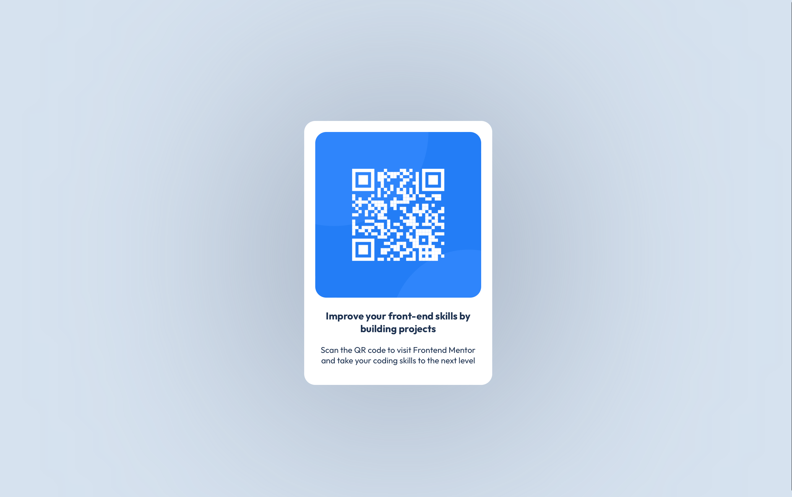

# Frontend Mentor - QR code component solution

This is a solution to the [QR code component challenge on Frontend Mentor](https://www.frontendmentor.io/challenges/qr-code-component-iux_sIO_H). 

## Table of contents

- [Frontend Mentor - QR code component solution](#frontend-mentor---qr-code-component-solution)
  - [Table of contents](#table-of-contents)
  - [Overview](#overview)
    - [Screenshot](#screenshot)
    - [Links](#links)
  - [My process](#my-process)
    - [Built with](#built-with)
    - [What I learned](#what-i-learned)
    - [Useful resources](#useful-resources)
  - [Author](#author)
  - [Acknowledgments](#acknowledgments)

## Overview

### Screenshot



### Links

- Solution URL: [Add solution URL here](https://your-solution-url.com)
- Live Site URL: [Add live site URL here](https://your-live-site-url.com)

## My process

### Built with

- Semantic HTML5 markup
- CSS custom properties
- Flexbox
- Visual Studio Code
- Tested on Safari & Chrome

### What I learned

When I first learned HTML and CSS, it was much more primitive than what developers now have at their disposal. I started with this project specifically because I knew it would be a great way to use Flexbox. I struggled with this until I found my solution buried (like usual) in Stack Overflow. I couldn't get my main div to center vertically despite technically being correct: turns out I had to set `html`, `body` and the main flex container to `100%` since my components were so small (I'm assuming).

```css
html {
    height: 100%;
}

body {
    background-color: hsl(212, 45%, 89%);
    font-size: 15px;
    font-family: "Outfit", sans-serif;
    color: hsl(218, 44%, 22%);
    height: 100%;
}

.container {
    display: flex;
    justify-content: center;
    align-items: center;
    height: 100%;
}

.qr-code {
    background-color: hsl(0, 0%, 100%);
    border-radius: 20px;
    box-shadow: 2px 5px 500px hsl(220, 15%, 55%);
    padding: 20px;
    text-align: center;
    width: 300px;
}
```

### Useful resources

- [CSS Grid: Guide to Flexbox](https://css-tricks.com/snippets/css/a-guide-to-flexbox/) - Great visual guide on Flexbox, it's various properties, and what you can expect those properties to do
- [Example resource 2](https://www.example.com) - This is an amazing article which helped me finally understand XYZ. I'd recommend it to anyone still learning this concept.

## Author

- Website - [Jenny Mikac](https://www.jennymikac.com)
- Frontend Mentor - [@jennymikac](https://www.frontendmentor.io/profile/yourusername)
- Twitter - [@yourusername](https://www.twitter.com/yourusername)

**Note: Delete this note and add/remove/edit lines above based on what links you'd like to share.**

## Acknowledgments

This is where you can give a hat tip to anyone who helped you out on this project. Perhaps you worked in a team or got some inspiration from someone else's solution. This is the perfect place to give them some credit.

**Note: Delete this note and edit this section's content as necessary. If you completed this challenge by yourself, feel free to delete this section entirely.**
